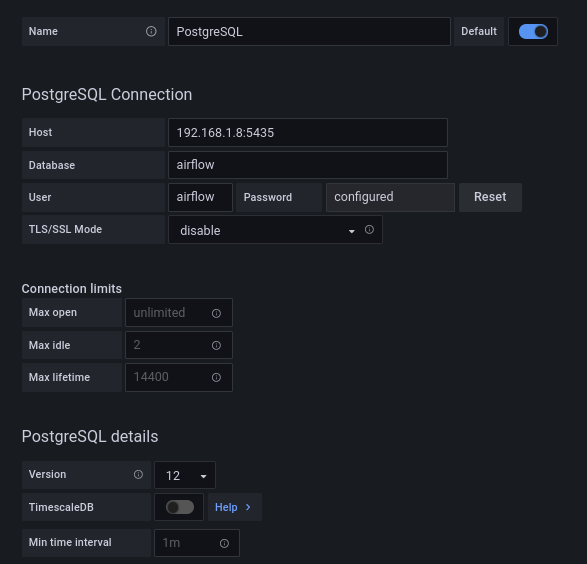

## Objetivo

Integrar las tecnologías trabajadas durante el seminario intensivo del ITBA:

* Docker
* PostgreSQL
* Una herramienta de visualización: Grafana

La información se levanta via una open api

## Descripción

* Datos de entrada vía [Open API](https://api.coindesk.com/v1/bpi/currentprice.json) de la cotización del bitcoin.
* Se inyecta en una DB de PostgresSQL utilizando linux cronetab para que corra un script de python.
* Se configuran las conexiones de DB y Grafana
* Se importa a través de un json un Dashboard de Grafana creado previamente.

## Ambiente

### Paso 1: Repo

Clonar el repo
~~~
git clone https://github.com/estebanfw/tp-seminario
~~~

### Paso 2: Inicializar Airflow

Para inicializar el ambiente
~~~
echo -e "AIRFLOW_UID=$(id -u)\nAIRFLOW_GID=0" > .env
~~~

Luego ejecutar
~~~
docker-compose up airflow-init
~~~
### Paso 3: Levantar contenedores

Para levantar los contenedores ejecutar:
~~~
docker-compose up
~~~

Aclaración de puertos elegidos:
* PostgreSQL: puerto local 5035
* Grafana: puerto local 3030

Luego configurar Grafana como se indica en dicha sección.

### Paso 4: Activar DAG de Airflow

* Abrir el explorador `http://localhost:8080`
* User: airflow
* Password: airflow
* Activar el DAG `getting data`

Una vez activado se debería ver de la siguiente manera:

### Paso 5: Verificar DB (opcional)

Chequear que se estén cargando los datos a la db de PostGres
dbname: airflow
user: airflow
password: airflow
table: btc

Para entrar a la terminal de bash del contenedor se puede utilizar el siguiente comando.
~~~
docker exec -it tp-seminario_db_1 bash
~~~
Dentro de la terminal:
~~~
psql -U airflow -d airflow
~~~
Inicia psql y dentro realizar la query:
~~~
select * from btc;
~~~
Un resultado similar a este se debería obtener
~~~
        datetime        |  coin   |   price    
------------------------+---------+------------
 2021-08-24 15:36:00+00 | Bitcoin | 48345.7819
 2021-08-24 15:37:00+00 | Bitcoin | 48507.5392
 2021-08-24 15:38:00+00 | Bitcoin |  48519.984
 2021-08-24 15:39:00+00 | Bitcoin |  48463.819
~~~

### Paso 6: Grafana

Ingresar con el explorador a 
~~~
http://localhost:3030/login
~~~
user: admin
password: admin

Cuando dice crear una nueva password, poner skip.

* Agregar un data source. La documentación oficial se encuentra en este [link](https://grafana.com/docs/grafana/v7.5/datasources/add-a-data-source/?utm_source=grafana_gettingstarted)
* Ir a engranaje (ruedita) -> data source
* Click en add data source
* Seleccionar Postgres SQL db
* Configuración de conexión.
  * Name: PostgresSQL (dejar default)
  * Host: localhost:5435 (en mi caso 192.168.1.8:5435 - esto está hardcodeado en el script de python también, tener cuidado y cambiar según corresponda)
  * Database: airflow
  * User: airflow
  * Password: airflow
  * TLS/SSL Mode: disable
  * PostgresSQL Details
    * Version: 12

Al finalizar clickear save and test. Debería salir un mensaje que la conexión está ok.

Crear el Dashboard, ir al + y clickear en import, upload json file `dashboard.json`.

Automáticamente se verá el dashboard que incluye:
* Cotización para cada timestamp cargado en la db
* Media móvil con una ventana de 6 registros.
* Máximo
* Mínimo
* Promedio
Se puede elegir el intervalo de tiempo que se desee desde el panel de grafana

Finalmente el Dashboard queda configurado, sólo es cuestión de ir esperando que pasen los minutos y se carguen los datos.

